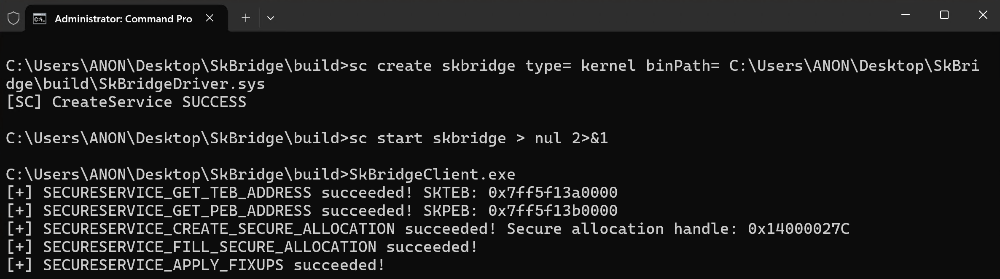

# SkBridge
SkBridge is a software package, made up of a driver (`SkBridgeDriver`) and user-mode client (`SkBridgeClient`), which is capable of issuing Virtual Secure Mode (VSM) calls from kernel-mode in Virtual Trust Level 0 (VTL 0) to kernel-mode in Virtual Trust Level 1 (VTL 1), via `nt!VslpEnterIumSecureMode`. These are also known as "secure calls". SkBridge only supports 64-bit builds and has only been tested on Windows 11 24H2 builds. There will be no releases associated with this tool (you must compile from source).

An associated blog post on secure calls can be found here: https://connormcgarr.github.io/secure-calls-and-skbridge/.

## Output


## Building And Usage
SkBridgeClient _must_ be run as an administrator, and it _must_ be run from the build directory (`SkBridge/build`). This is because SkBridge relies on symbol files. Thus, in the `SkBridge/SkBridgeClient/SymbolDlls` directory I have shipped the proper `dbghelp.dll` and `symsrv.dll` DLLs. If you do not want to use the binaries I have provided, please just drop your own `dbghelp.dll` and `symsrv.dll` files from the Windows SDK into the aforementioned directory.

Build the project and then, from an administrative Command Prompt, run:

```
cd C:\Full\Path\To\SkBridge\build

sc create skbridge type= kernel binPath= C:\Full\Path\To\SkBridge\build\SkBridgeDriver.sys

sc start skbridge

.\SkBridgeClient.exe

sc stop skbridge
```

## Documentation
You can find the relevant documentation in this section of the README. Note that `SkBridge/SkBridgeClient/Source Files/Examples.cpp` contains many examples of using SkBridgeClient to interact with SkBridge and to retrieve the secure call values back to user-mode, but this section will at least provide more details.

The "gist" of the project is that you are able to specify both _parameters_ and _parameter modifiers_ when issuing secure calls. For example:

```c
secureCallData.SecureCallFields.Field1.u.Value = lsaIsoPid;
secureCallData.SecureCallFieldDescriptors.Field1Descriptor = ScDescOptPidToSecureProcessHandle;
```

This indicates the following:
1. The first secure call argument (`Field1`) is set to the process ID (PID) of `LsaIso.exe`.
2. The PID will be _modified_ to actually be the "secure process handle" of `LsaIso.exe` (found in the `KPROCESS` structure)

In the above example the _true_ argument passed to this secure call is a secure process handle. However, this information is not accessible to user-mode (where `SkBridgeClient.exe` is running, which runs the above code). Because of this, SkBridge exposes parameter _modifiers_ (called "field descriptor options"). The supported options can be found in `SkBridge/Shared.hpp`. The "current" options (but can change in the future) are as follows:

```c
//
// Secure call parameter descriptor values
//
enum SecureCallParameterDescriptorOptions : ULONG
{
    ScDescOptNone = 0,
    ScDescOptEncapsulateAsMdl = 0x1,
    ScDescOptPidToProcessObject = 0x2,
    ScDescOptPidToSecureProcessHandle = 0x4,
    ScDescOptTidToThreadObject = 0x8,
    ScDescOptTidToSecureThreadCookie = 0x10,

    //
    // A "special" flag which will create a handle to the section object
    // of a loaded image.
    //
    ScDescOptPidToSectionObjectHandle = 0x20,

    //
    // A "special" flag which will retrieve the associated secure image handle
    // from an already-mapped process or kernel-mode image.
    //
    ScDescOptPidToSecureImageHandle = 0x40,
    ScDescOptKernelImageBaseToSecureImageHandle = 0x80,
    
    //
    // Converts the specified VA to PFN
    //
    ScDescOptConvertVirtualAddressToPageFrameNumber = 0x100,

    //
    // A common pattern in SK is to provide the PFN for an MDL,
    // which already describes a parameter, as a parameter itself.
    // This flag instructs SkBridgeDriver as to what argument number
    // the MDL exists at for which this field should be a PFN
    // 
    // An example is Field2.u.Value = address;
    // 
    // If Field2 has the "encapsulate as MDL" flag, set this
    // value to 2. This will make the target argument the PFN
    // of that MDL.
    //
    ScDescOptGetPfnForMdlAtTargetArgumentField = 0x200,

    //
    // Reserved for SkBridgeDriver
    //
    ScDescOptReleaseResource = 0x81000000,
};
```

The `ScDescOptGetPfnForMdlAtTargetArgumentField` is of importance. A common pattern in secure calls is to encapsulate certain parameters as MDLs and then also provide the page frame number (PFN) associated with the MDL. This allows the Secure Kernel to map the arguments into the virtual address space of VTL 1 and also verify the MDL. An example usage of these flags would be:

1. Provide a parameter
2. Ask that the parameter be encapsulated as an MDL. Provide the size of the parameter (`OptionalMdlSize`)
3. The _next_ parameter allows you to set the field number (argument number) where the MDL resides. SkBridgeDriver will then extract the PFN of the MDL and setup the PFN parameter correctly.

```c
//
// Technically MDL describing the allocation.
// 
// This setup will ask SkBridge to encapsulate the address as an MDL and to use
// the following size when creating the MDL.
//
secureCallData.SecureCallFields.Field3.u.Value = (ULONGLONG)allocation;
secureCallData.SecureCallFields.Field3.OptionalMdlSize = 0x1000;
secureCallData.SecureCallFieldDescriptors.Field3Descriptor = ScDescOptEncapsulateAsMdl;

//
// This instructs SkBridgeDriver to make argument 4 the PFN of argument 3 (which is an MDL).
// This flag requires that the target field has "ScDescOptEncapsulateAsMdl" set.
// 
// A very common pattern is to encapsulate a parameter as an MDL and the _next_ parameter becomes the PFN
// of the MDL which describes the parameter which has been encapsulated by an MDL.
//
secureCallData.SecureCallFields.Field4.u.Value = 3;
secureCallData.SecureCallFieldDescriptors.Field4Descriptor = ScDescOptGetPfnForMdlAtTargetArgumentField;
```

Another thing to note is that there are "extended" parameters. The Secure Kernel will select a particular thread, if necessary, based on a "secure thread cookie". This is the target thread context in which the secure call will execute. Only secure processes have secure threads. If you set the extended parameter option for a target secure thread cookie, SkBridgeDriver will issue the secure call in _context_ of the target thread (and, thus, the secure call will be issued in context of this thread):

```c
secureCallData.ExtendedParameters.OptionalSecureThreadCookieThreadId = lsaIsoTid;
secureCallData.ExtendedParameterOptions = ScExtendedParameterHasSecureThreadCookie;
```

There is no "list of secure calls" provided. Using the `GetSecureCallValue` found in `SkBridge/SkBridgeClient/Source Files/Helpers.cpp` you can specify the string of a secure call found in the `nt!_SKSERVICE` enum via the NT symbols (which SkBridgeClient will load):

```c
secureCallData.SecureCallType = GetSecureCallValue(L"SECURESERVICE_CREATE_SECURE_ALLOCATION");
```

You (obviously) are not limited to what is in `SkBridge/SkBridgeClient/Source Files/Examples.cpp`. The only requirement is that `InitializeSkBridge` is called in your application before anything else, and that `CleanupSkBridgeClient` is invoked on application exit.

## Caveats
SkBridge relies on a kernel-mode driver. Because of this you will need to enable test signing. Please make sure to suspend Bit Locker protection, if you are using Bit Locker, before changing the test signing policy on your computer (and when you turn test signing back off, do the same). It is, therefore, highly-recommended to run this project in a VM.

You must have Virtualization-Based Security (VBS) enabled in order to interact with VTL 1.

SkBridge hardcodes the symbol path to `srv*C:\\Symbols*http://msdl.microsoft.com/download/symbols` To change this, you should edit `SkBridge/SkBridgeClient/Source Files/Initialization.cpp`, specifically this line:

```c
if (SymSetSearchPathW_I(GetCurrentProcess(),
                        L"srv*C:\\Symbols*http://msdl.microsoft.com/download/symbols") == FALSE)
{
    wprintf(L"[-] Error! SymSetSearchPathW failed in InitializeSymbols. (GLE: %d)\n", GetLastError());
    goto Exit;
}
```

This project uses undocumented structures and offsets in structures. It has only been tested against Windows 11 24H2, but `SkBridgeClient` _does_ extract the offsets of the relevant structures/functions using symbols instead of hardcoding them. There is no expectation that the structure layouts will remain the same (e.g., "this" structure member resides in "that" union. The union could add more fields which the "target" structure could be moved to). SkBridgeDriver will never be fully-initialized if SkBridgeClient is unable to extract these structure/function offsets.

Lastly, there are custom post-build events setup in the SkBridge solution Visual Studio projects. Because of this, on "rebuild" or "clean" the build directory will be cleared out. This will attempt to delete `SkBridgeDriver.sys`. Because of this, if you are going to rebuild the entire solution or clean it, you will need to stop the driver:

`sc stop skbridge`

This code should be treated as POC-quality and ships with zero guarantees! Please do not deploy to production.